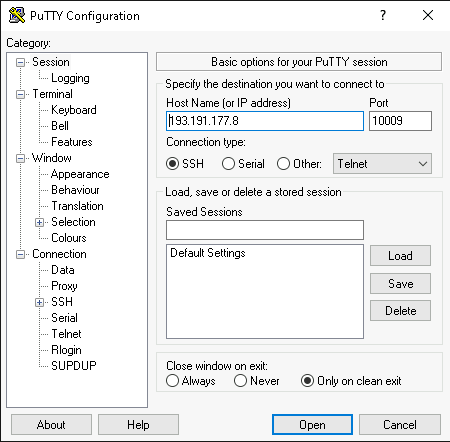
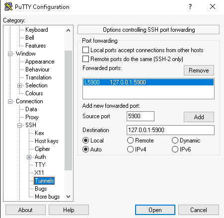
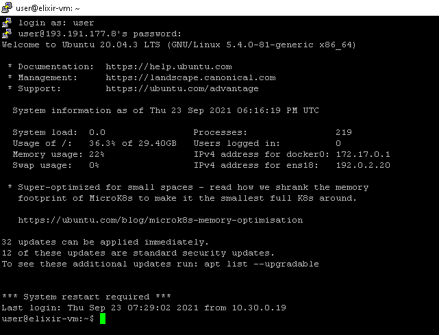
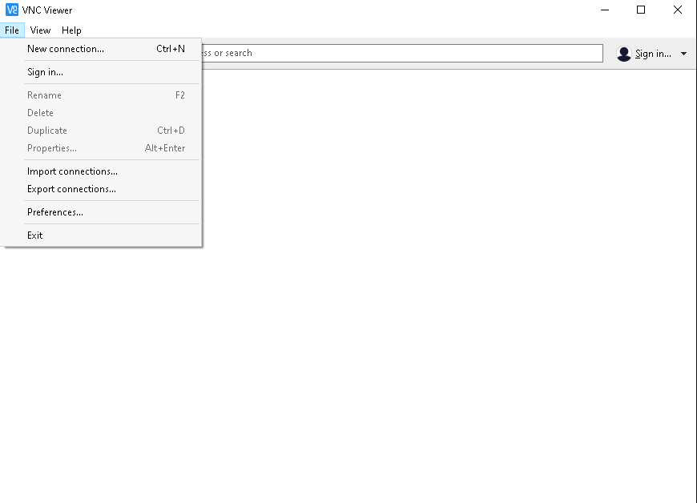
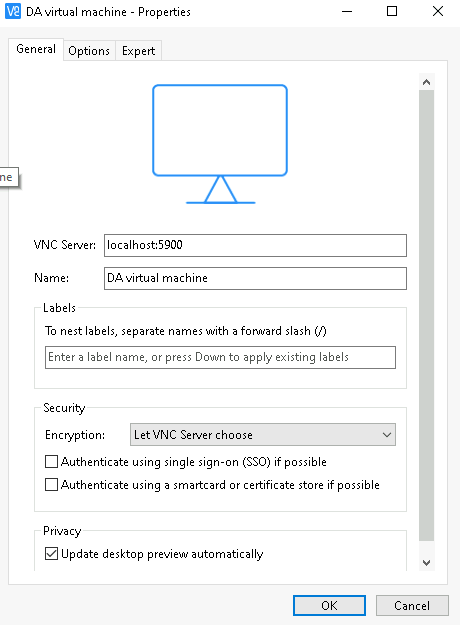
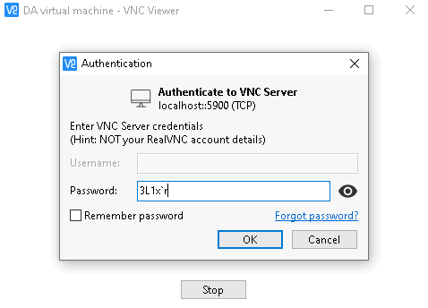
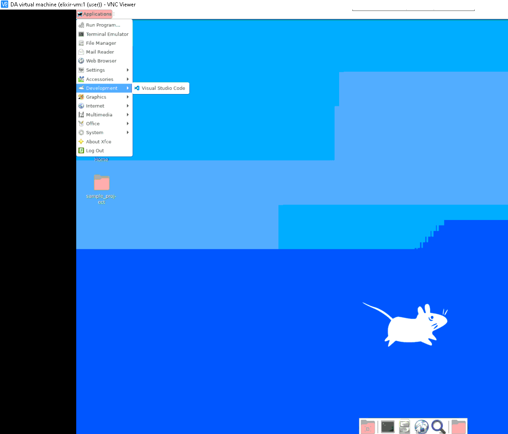
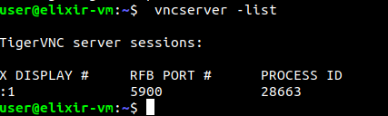
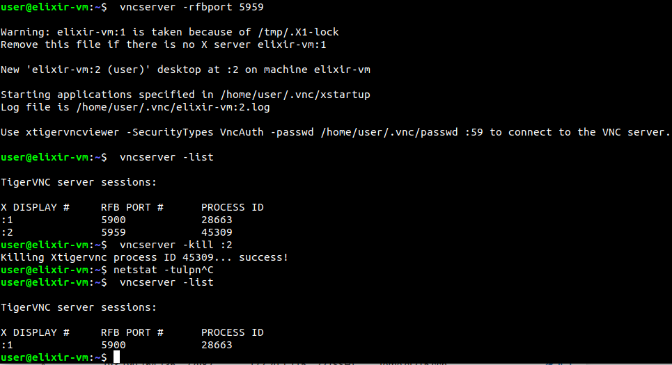

# Gebruik VM

Ik raad aan om vncviewer over ssh te gebruiken. Blijkbaar heeft de huidige image by default geen encryptie, dus kan je dit bereiken over een ssh tunnel. Je kan de poort 5900 publiek openzetten, waardoor je er van buitenaf zal aankunnen. Bijvoorbeeld:

* Poort 10009 = ssh access
* Poort 10010 = port forward naar je machine poort 5900. LET OP: je moet wel op je vncserver publieke connecties toelaten, zoniet kan je er enkel via ssh & localhost op.

Hier gaan we overlopen hoe je de ssh tunnel met Putty kan configureren.

## SSH tunnel

### Basis configuratie + ssh tunnel

### Inloggen

Dit is vanzelfsprekend, maar vanaf je op "Open" drukt kan je inloggen als user `user`.

**Het kan zijn dat je oftewel je local port forward moet aanpassen, of je vnc server port. Kijk hiervoor onderaan bij "Extra: VNC server poort wijzigen".**

## VNC Viewer config

**LET OP: stel je vnc password in met `vncpasswd`.**

Veel plezier!

## Extra: VNC server poort wijzigen

### Sessies oplijsten

### Poort wijzigen & sessie afsluiten

Op onderstaande afbeelding kan je zien hoe je een nieuwe vnc server sessie maakt, waarna je alles oplijst. Dan kill je de (onnodige) sessie, waarna je het nakijkt met `vncserver -list`

Je kan ook je dimensies etc... configureren. Lees `vncserver --help`.
